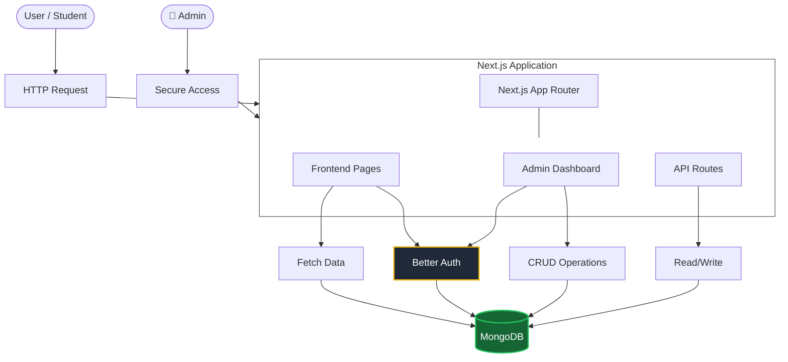

# 🏛️ Project Blueprint: Learn With Robiul Islam (Educational Platform)

> [!NOTE]
> প্রজেক্টের মূল লক্ষ্য: শিক্ষার্থীদের জন্য ইংরেজি এবং ইসলামিক ইতিহাস ও সংস্কৃতি (IHC) একটি প্রিমিয়াম, ডাইনামিক এবং ইউজার-ফ্রেন্ডলি এডুকেশনাল প্ল্যাটফর্ম তৈরি করা। এই প্ল্যাটফর্মটির মাধ্যমে কন্টেন্ট ম্যানেজমেন্ট, ভিডিও ক্লাস এবং পিডিএফ রিসোর্স শেয়ারিং সম্পূর্ণ জিরো-কোডভাবে পরিচালিত হবে।

## 💻 1. Technology Stack (প্রযুক্তির বিবরণ)
- **Frontend & Backend:** Next.js (App Router), React 19
- **Styling:** Tailwind CSS (কাস্টম থিম এবং কালার প্যালেট)
- **Animations:** Framer Motion, GSAP, Lenis (স্মুথ এবং প্রিমিয়াম ইউজার এক্সপেরিয়েন্সের জন্য)
- **Database:** MongoDB (ডেটা স্টোর করার জন্য দ্রুত এবং স্কেলেবল NoSQL ডেটাবেজ)
- **Authentication:** Better Auth (Google, Facebook, এবং Email/Password লগইনের জন্য সম্পূর্ণ সুরক্ষিত সিস্টেম)

## 🏗️ 2. System Architecture (সিস্টেম আর্কিটেকচার)
ওয়েবসাইটটি Client-Server Architecture ফলো করে তৈরি করা হয়েছে। সিকিউরিটি এবং পারফরম্যান্স নিশ্চিত করার জন্য Next.js-এর আধুনিক সার্ভার কম্পোনেন্ট ব্যবহার করা হয়েছে।

## 📁 3. Database Models (ডেটাবেজ কাঠামো)
পুরো ওয়েবসাইটের ডেটা ৪টি মূল কালেকশনে (Collections) ভাগ করা হয়েছে। ক্লায়েন্ট ড্যাশবোর্ড থেকে এই ডেটাগুলো কন্ট্রোল করতে পারবেন:

1. **Lessons (ভিডিও লেসন):**
   - **ফিল্ডসমূহ:** `title`, `description`, `category` (English/IHC), `videoUrl`, `thumbnailUrl`, `status`.
   - **কাজ:** ইংরেজি ও IHC ভিত্তিক লেসনগুলো এখানে স্টোর করা হয়।

2. **Posts / Articles (আর্টিকেল):**
   - **ফিল্ডসমূহ:** `title`, `slug`, `category`, `excerpt`, `content`, `thumbnailUrl`, `status`.
   - **কাজ:** IHC Chronicles-এর গবেষণাধর্মী আর্টিকেল এবং ব্লগ পোস্টগুলো সংরক্ষণ করা।

3. **Resources (স্টাডি ম্যাটেরিয়াল):**
   - **ফিল্ডসমূহ:** `title`, `category`, `fileUrl` (PDF link), `fileSize`, `downloadCount`.
   - **কাজ:** শিক্ষার্থীদের জন্য লেকচার শিট ও পিডিএফ ডাউনলোডের ব্যবস্থা করা।

4. **Classes (লাইভ ক্লাস/নোটিশ):**
   - **ফিল্ডসমূহ:** `title`, `type` (Live/Workshop), `date`, `time`, `seats`.
   - **কাজ:** ওয়েবসাইটের নোটিশ বোর্ডে আপকামিং ক্লাসের শিডিউল দেখানো।

## ⚙️ 4. How the Website Works (ওয়েবসাইটটি কীভাবে কাজ করে)
এই ওয়েবসাইটটির কার্যপ্রক্রিয়া প্রধানত দুটি ভাগে ভাগ করা যায়: User Flow (শিক্ষার্থীদের জন্য) এবং Admin Flow (অ্যাডমিনদের জন্য)। আপনি ক্লায়েন্টকে নিচের স্টেপগুলো ধাপে ধাপে বোঝাতে পারবেন।

### 👨‍🎓 Student / User Flow (স্টুডেন্টরা কীভাবে ব্যবহার করবে)
1. **Public Browsing:** যে কোনো ইউজার ওয়েবসাইটে এসে হোমপেজ, নোটিশ বোর্ড, এবং কোর্সের ডেসক্রিপশন দেখতে পারবে।
2. **Dynamic Content Fetching:** যখনই ইউজার `/lessons`, `/articles`, বা `/resources` পেজে যায়, আমাদের সিস্টেম সাথে সাথে MongoDB ডেটাবেজ থেকে রিয়েল-টাইম ডেটা ফেচ করে ওয়েবে প্রদর্শন করায়।
3. **Authentication Wall (কন্টেন্ট সিকিউরিটি):**
   - ইউজার যদি কোনো প্রিমিয়াম পিডিএফ ডাউনলোড করতে চায় বা সম্পূর্ণ আর্টিকেল পড়তে চায়, তখন সিস্টেম তাকে বাধা দিয়ে লগইন বা সাইনআপ করতে বলবে।
   - লগইন করা না থাকলে একটি দৃষ্টিনন্দন পপ-আপ (Auth Modal) আসবে বা ইউজারকে লগইন বা সাইনআপ পেজে রিডাইরেক্ট করবে।
4. **Login/Signup System:** ইউজার Google, Facebook অথবা Email-এর মাধ্যমে খুব সহজেই অ্যাকাউন্ট তৈরি করতে পারবে। লগইন করার পর তারা সাইটের সকল প্রিমিয়াম কন্টেন্ট অ্যাক্সেস করতে পারবে।

### 👑 Admin Flow (অ্যাডমিন কীভাবে সাইটটি পরিচালনা করবে)
1. **Secure Admin Panel:** অ্যাডমিন প্যানেল (`/admin`) সম্পূর্ণ সুরক্ষিত। সাধারণ ইউজাররা এই লিংকে ঢুকতে পারবে না। শুধুমাত্র অ্যাডমিন রোল থাকা অ্যাকাউন্ট থেকেই এখানে ঢোকা যাবে।
2. **Dashboard Management:**
   - অ্যাডমিন ড্যাশবোর্ড থেকে নতুন ক্লাস শিডিউল, ভিডিও লেসন, আর্টিকেল, এবং পিডিএফ রিসোর্স যোগ (Add), এডিট (Edit), বা ডিলিট (Delete) করতে পারবেন।
3. **Real-time Sync (রিয়েল-টাইম সিঙ্কিং):** অ্যাডমিন প্যানেল থেকে কোনো ডেটা আপডেট বা ডিলিট করার সাথে সাথে তা ডেটাবেজে সেভ হয়ে যাবে এবং ফ্রন্টএন্ডে স্টুডেন্টদের কাছে অটোমেটিক্যালি আপডেট হয়ে যাবে। এর জন্য কোনো কোড পরিবর্তন বা পেজ রিলোড করার প্রয়োজন নেই।

## ✨ 5. Key Selling Points (ক্লায়েন্টকে ইমপ্রেস করার জন্য হাইলাইটস)

> [!TIP]
> প্রেজেন্টেশন দেওয়ার সময় ক্লায়েন্টকে ওয়েবসাইটের এই পয়েন্টগুলো ফোকাস করবেন:

- **Premium UI/UX:** অত্যন্ত আধুনিক এবং দৃষ্টিনন্দন ডিজাইন। গ্লাস মর্ফিজম (Glassmorphism), স্মুথ স্ক্রলিং এবং মাইক্রো-অ্যানিমেশন ব্যবহার করা হয়েছে যা সাইটটিকে অন্য দশটা সাধারণ এডুকেশন সাইট থেকে সম্পূর্ণ আলাদা করে।
- **100% Dynamic & Scalable:** ওয়েবসাইটের সব কন্টেন্ট ডাইনামিক। ক্লায়েন্ট তার অ্যাডমিন ড্যাশবোর্ড থেকে খুব সহজেই পুরো ওয়েবসাইট কন্ট্রোল করতে পারবেন।
- **Secure Content / Lead Generation:** লগইন ছাড়া কেউ পিডিএফ বা পুরো আর্টিকেল পড়তে পারবে না। এটি সাধারণ ভিজিটরদের সাইনআপ করতে বাধ্য করবে, যার ফলে ক্লায়েন্ট প্রচুর স্টুডেন্ট ডেটা (লিড) পাবেন।
- **Extreme Performance:** Next.js Server Components ব্যবহারের কারণে ওয়েবসাইট লোড হতে একটুও সময় লাগে না, সাইটটি সুপার ফাস্ট এবং SEO-বান্ধব (Google Search-এ সহজে র‍্যাংক করবে)।
